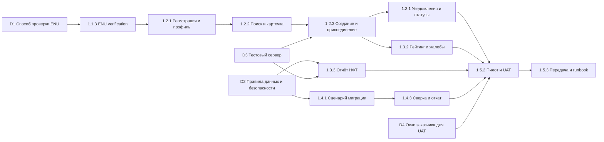

# Карта зависимостей ENUWay

Критическая последовательность планирования: D1 → 1.1.3 → 1.2.1 → 1.2.2 → 1.2.3 → 1.3.1 → 1.5.2 → 1.5.3. Даты ниже являются плановыми точками подтверждения, а не утверждением, что внешняя сторона уже дала согласие.

## Реестр внешних зависимостей

| ID | Зависимость и внешняя сторона | Владелец внутри команды | Дата подтверждения | Что блокирует | План при срыве |
|---|---|---|---|---|---|
| D1 | Способ проверки ENU и тестовая конфигурация от ИТ-службы университета | Участник 1 | 09.10.2026 | 1.1.3 и регистрацию | Временный allowlist домена ENU и ручная проверка учебных аккаунтов |
| D2 | Согласование правил персональных данных и безопасности представителем заказчика | Участник 2 | 23.10.2026 | Пилот с пользователями, НФТ и миграцию | Пилот только на синтетических данных и без хранения необязательных полей |
| D3 | Тестовый сервер и доступ к журналам от ИТ-службы университета | Участник 3 | 30.10.2026 | Развёртывание и нагрузочные тесты | Локальный Docker-стенд и автоматические проверки в GitHub Actions |
| D4 | Окно заказчика и пользователей для UAT | Участник 1 | 20.11.2026 | Веху M3 и передачу | Асинхронный UAT по видео и сценариям с последующим письменным подтверждением |

Зависимости пересматриваются на еженедельном статусе. Если подтверждение не получено к указанной дате, зависимость переводится в RAID-лог как риск и запускается запасной ход.
